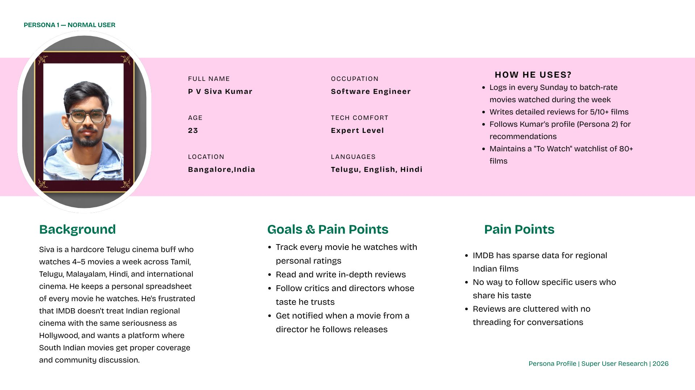
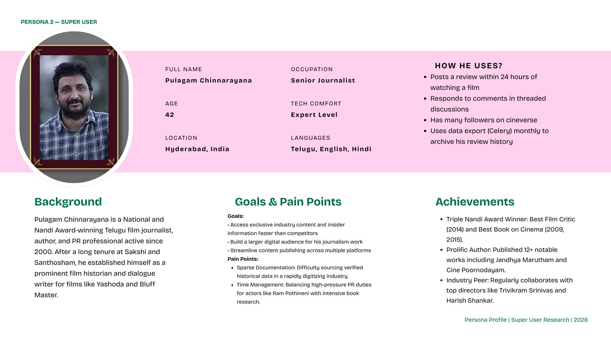
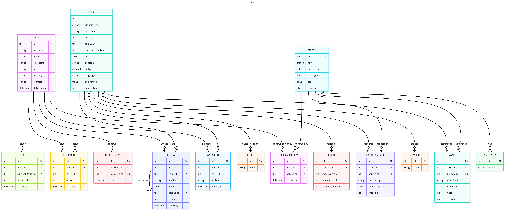

# CineVerse — IMDB Clone
---

## What Am I Building?

**CineVerse** is a full-featured IMDB clone — a community-driven movie & TV database where users can:

- **Discover** movies, TV shows, episodes, and the people behind them (actors, directors, writers)
- **Rate & Review** titles on a 1–10 scale with written reviews
- **Follow** other users and celebrities/artists
- **Comment** in threaded conversations on reviews
- **Like** reviews and comments
- **Maintain a Watchlist** of movies to watch, currently watching, or finished
- **Get notified** about activity in their network

**Stack:**
- Backend: Django 4.x + Django REST Framework (optional API layer)
- DB: PostgreSQL
- Auth: `django-allauth` (email/social login)
- Threaded Comments: `django-mptt` (Modified Preorder Tree Traversal)
- Likes: `django-contrib-comments` or custom GenericForeignKey (polymorphic)
- Search: Elasticsearch + `django-elasticsearch-dsl`
- Async Tasks: Celery + Redis
- Deployment: AWS / Render / Fly.io (free tier)

---

## 👤 User Personas

### Persona 1 — P V Siva Kumar

| Field | Detail |
| :--- | :--- |
| **Full Name** | P V Siva Kumar |
| **Age** | 23 |
| **Location** | JP Nagar, Bangalore |
| **Occupation** | Software Engineer at MountBlue |
| **Tech Comfort** | High — uses streaming platforms, Reddit, IMDB |
| **Language** | Telugu, Hindi, English |

**Background:**
Siva is a hardcore Telugu cinema buff who watches 4–5 movies a week across Telugu, Hindi, and international cinema. He keeps a personal spreadsheet of every movie he watches. He's frustrated that IMDB doesn't treat Indian regional cinema with the same seriousness as Hollywood, and wants a platform where South Indian movies get proper coverage and community discussion.

**Goals:**
- Track every movie he watches with personal ratings
- Read and write in-depth reviews
- Follow critics and directors whose taste he trusts
- Get notified when a movie from a director he follows releases

**Pain Points:**
- IMDB has sparse data for regional Indian films
- No way to follow specific users who share his taste
- Reviews are cluttered with no threading for conversations

**How He Uses CineVerse:**
- Logs in every Sunday to batch-rate movies watched during the week
- Writes detailed reviews for 5/10+ films
- Follows Kumar's profile (Persona 2) for recommendations
- Maintains a "To Watch" watchlist of 80+ films



---

### Persona 2 — Super User
# [Pulagam Chinnarayana](https://wikipedia.org/wiki/Pulagam_Chinnarayana)


| Field | Detail |
| :--- | :--- |
| **Full Name** | [Pulagam Chinnarayana](https://en.wikipedia.org/wiki/Pulagam_Chinnarayana) |
| **Age** | 44 (Born: 1982) |
| **Location** | Hyderabad, Telangana |
| **Occupation** | Author, Film Historian, Dialogue Writer & PRO |
| **Tech Comfort** | High — Manages professional site and active on X/Instagram |
| **Languages** | Telugu, English, Hindi |
**Background:** Pulagam Chinnarayana is a National and Nandi Award-winning Telugu film journalist, author, and PR professional active since 2000. After a long tenure at *Sakshi* and *Santhosham*, he established himself as a prominent film historian and dialogue writer for films like *Yashoda* and *Bluff Master*.

**Goals:**
- **Document Film History:** Preserve the legacy of Telugu cinema through deeply researched books like *Pasidi Thera*.
- **Bridge Eras:** Introduce modern audiences to cinematic legends (e.g., Jandhyala, B. Vittalacharya) through biographies.
- **Creative Versatility:** Balance active film production roles (dialogue/lyrics) with historical journalism.

**Pain Points:**
- **Sparse Documentation:** Difficulty sourcing verified historical data in a rapidly digitizing industry.
- **Time Management:** Balancing high-pressure PR duties for actors like Ram Pothineni with intensive book research.

**Achievements:**
- **Triple Nandi Award Winner:** Best Film Critic (2014) and Best Book on Cinema (2009, 2015).
- **Prolific Author:** Published 12+ notable works including *Jandhya Marutham* and *Cine Poornodayam*.
- **Industry Peer:** Regularly collaborates with top directors like Trivikram Srinivas and Harish Shankar.



## 📋 User Stories

> 🟢 = implementable in Week 1

> 🔵 = implementable in Week 2

> 🟡 = stretch / future

### Authentication & Profiles
- 🟢 As a visitor, ISBAT register with email and password so I can create an account
- 🟢 As a visitor, ISBAT log in with my email/password
- 🟢 As a logged-in user, ISBAT log out
- 🟢 As a logged-in user, ISBAT edit my profile (name, bio, avatar, location)
- 🟢 As a visitor, ISBAT view any user's public profile page showing their reviews and ratings
- 🔵 As a visitor, ISBAT sign up/log in with Google (django-allauth social)

### Movies & TV (Content Discovery)
- 🟢 As a visitor, ISBAT browse the homepage showing featured/top-rated movies
- 🟢 As a visitor, ISBAT view a movie detail page (title, year, genre, cast, crew, plot, rating)
- 🟢 As a visitor, ISBAT view a person's page (actor/director bio, filmography)
- 🟢 As a visitor, ISBAT browse movies by genre
- 🔵 As a visitor, ISBAT search for movies and people by name (basic DB search first, Elasticsearch later)
- 🔵 As an admin, ISBAT add/edit/delete movies, people, and cast information via Django admin

### Ratings
- 🟢 As a logged-in user, ISBAT rate a movie on a scale of 1–10
- 🟢 As a logged-in user, ISBAT update or delete my rating
- 🟢 As a visitor, ISBAT see the average rating and vote count for each movie
- 🟢 As a logged-in user, ISBAT see my own rating highlighted on the movie page

### Reviews & Threaded Comments
- 🟢 As a logged-in user, ISBAT write a review for a movie I've seen
- 🟢 As a logged-in user, ISBAT edit or delete my own review
- 🟢 As a visitor, ISBAT read all reviews for a movie, sorted by helpfulness or date
- 🟢 As a logged-in user, ISBAT reply to a review (creates a threaded comment — django-mptt)
- 🟢 As a logged-in user, ISBAT reply to a comment (nested threading, unlimited depth)
- 🟢 As a visitor, ISBAT read all comment threads under a review

### Likes
- 🟢 As a logged-in user, ISBAT like a review
- 🟢 As a logged-in user, ISBAT like a comment
- 🟢 As a logged-in user, ISBAT unlike a review or comment I previously liked
- 🟢 As a visitor, ISBAT see the like count on reviews and comments

### Watchlist
- 🟢 As a logged-in user, ISBAT add a movie to my watchlist with a status: Want to Watch / Watching / Watched
- 🟢 As a logged-in user, ISBAT update the status of a movie in my watchlist
- 🟢 As a logged-in user, ISBAT remove a movie from my watchlist
- 🟢 As a logged-in user, ISBAT view my watchlist filtered by status

### Following / Connections
- 🟢 As a logged-in user, ISBAT follow another user
- 🟢 As a logged-in user, ISBAT unfollow a user I'm following
- 🟢 As a logged-in user, ISBAT view my followers and following lists
- 🔵 As a logged-in user, ISBAT follow a celebrity/person (actor, director)
- 🔵 As a logged-in user, ISBAT see a feed of reviews and ratings from people I follow

### Search (Elasticsearch)
- 🔵 As a visitor, ISBAT search for movies by title and get instant results
- 🔵 As a visitor, ISBAT search for people by name
- 🔵 As a visitor, ISBAT filter search results by genre, year, rating

### Data Export (Celery)
- 🟡 As a logged-in user, ISBAT request an export of all my reviews as CSV/JSON
- 🟡 The export is processed in the background (Celery task) and emailed to me when ready

---

## 🗃️ ER Diagram (Mermaid)

> Paste the block below at https://mermaid.live to render

```mermaid
erDiagram

    USER {
        int id PK
        string username
        string email
        string password_hash
        string full_name
        string bio
        string avatar_url
        string location
        datetime date_joined
        bool is_staff
    }

    TITLE {
        int id PK
        string primary_title
        string original_title
        string title_type
        int start_year
        int end_year
        int runtime_minutes
        text plot
        string poster_url
        decimal budget
        decimal box_office_gross
        string country
        string language
        bool is_adult
        float avg_rating
        int num_votes
    }

    GENRE {
        int id PK
        string name
    }

    TITLE_GENRE {
        int title_id FK
        int genre_id FK
    }

    PERSON {
        int id PK
        string name
        int birth_year
        int death_year
        text bio
        string photo_url
        string birth_place
    }

    PROFESSION {
        int id PK
        string name
    }

    PERSON_PROFESSION {
        int person_id FK
        int profession_id FK
    }

    PRINCIPAL_CAST {
        int id PK
        int title_id FK
        int person_id FK
        string role_category
        string character_name
        int ordering
    }

    EPISODE {
        int id PK
        int series_id FK
        int episode_title_id FK
        int season_number
        int episode_number
    }

    USER_RATING {
        int id PK
        int user_id FK
        int title_id FK
        int score
        datetime created_at
        datetime updated_at
    }

    REVIEW {
        int id PK
        int user_id FK
        int title_id FK
        string headline
        text body
        int lft
        int rght
        int tree_id
        int level
        int parent_id FK
        bool is_spoiler
        datetime created_at
        datetime updated_at
    }
```

<div style="display: flex; gap: 2%;">
<div style="flex: 1;">



</div>
<div style="flex: 1;">

```mermaid


    LIKE {
        int id PK
        int user_id FK
        int content_type_id FK
        int object_id
        datetime created_at
    }

    WATCHLIST {
        int id PK
        int user_id FK
        int title_id FK
        string status
        int personal_rating
        datetime added_at
        datetime updated_at
    }

    USER_FOLLOW {
        int id PK
        int follower_id FK
        int following_id FK
        datetime created_at
    }

    PERSON_FOLLOW {
        int id PK
        int user_id FK
        int person_id FK
        datetime created_at
    }

    AWARD {
        int id PK
        int title_id FK
        int person_id FK
        string award_name
        string organization
        string category
        int year
        bool is_winner
    }

    KEYWORD {
        int id PK
        string name
    }

    TITLE_KEYWORD {
        int title_id FK
        int keyword_id FK
    }

    PHOTO {
        int id PK
        int title_id FK
        int person_id FK
        string url
        string caption
        string photo_type
        datetime uploaded_at
    }

    CONTENT_TYPE {
        int id PK
        string app_label
        string model
    }

    USER ||--o{ USER_RATING : "gives"
    USER ||--o{ REVIEW : "writes"
    USER ||--o{ LIKE : "gives"
    USER ||--o{ WATCHLIST : "maintains"
    USER ||--o{ USER_FOLLOW : "follows as follower"
    USER ||--o{ USER_FOLLOW : "followed as following"
    USER ||--o{ PERSON_FOLLOW : "follows celebrity"

    TITLE ||--o{ USER_RATING : "receives"
    TITLE ||--o{ REVIEW : "has"
    TITLE ||--o{ WATCHLIST : "in"
    TITLE ||--o{ TITLE_GENRE : "categorized by"
    TITLE ||--o{ PRINCIPAL_CAST : "features"
    TITLE ||--o{ EPISODE : "is series of"
    TITLE ||--o{ AWARD : "wins/nominated"
    TITLE ||--o{ TITLE_KEYWORD : "tagged with"
    TITLE ||--o{ PHOTO : "has"

    PERSON ||--o{ PRINCIPAL_CAST : "appears in"
    PERSON ||--o{ PERSON_PROFESSION : "has"
    PERSON ||--o{ AWARD : "wins/nominated"
    PERSON ||--o{ PERSON_FOLLOW : "followed by"
    PERSON ||--o{ PHOTO : "has"

    PROFESSION ||--o{ PERSON_PROFESSION : "assigned to"
    GENRE ||--o{ TITLE_GENRE : "used in"
    KEYWORD ||--o{ TITLE_KEYWORD : "used in"

    REVIEW ||--o{ REVIEW : "parent of (threaded)"

    CONTENT_TYPE ||--o{ LIKE : "typed for"

    EPISODE }o--|| TITLE : "episode of series"
    EPISODE }o--|| TITLE : "is itself a title"
```

</div>
</div>



---

## 📁 Django App Estimation Structure

```
cineverse/                  ← Django project root
├── manage.py
├── requirements.txt
├── .env
├── cineverse/              ← project settings package
│   ├── settings/
│   │   ├── base.py
│   │   ├── development.py
│   │   └── production.py
│   ├── urls.py
│   ├── wsgi.py
│   └── celery.py
│
├── apps/
│   ├── accounts/           ← User model, auth, profiles (django-allauth)
│   ├── titles/             ← Movie, TVShow, Episode models
│   ├── people/             ← Person, Profession, PrincipalCast
│   ├── reviews/            ← Review model (django-mptt for threading)
│   ├── ratings/            ← UserRating
│   ├── likes/              ← Like (GenericForeignKey/ContentType)
│   ├── watchlist/          ← Watchlist model
│   ├── follows/            ← UserFollow, PersonFollow
│   ├── search/             ← Elasticsearch integration (django-elasticsearch-dsl)
│   └── exports/            ← Celery tasks for data export
│
├── templates/
├── static/
└── media/
```

---

